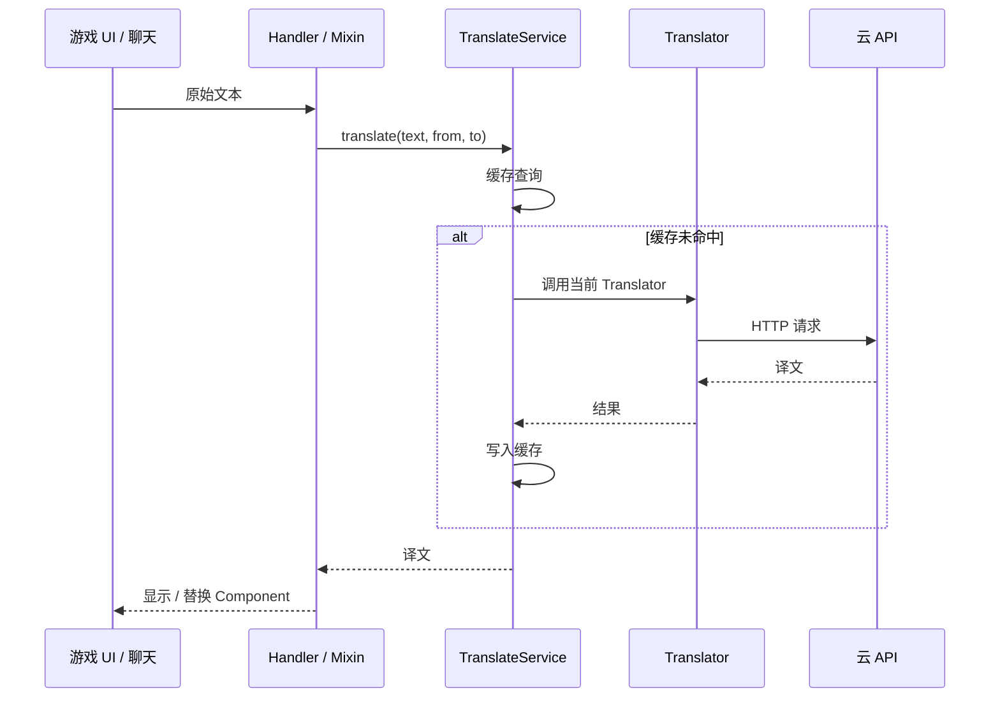

# 架构说明

## 分层架构

```mermaid
flowchart TB
    subgraph NeoForge["NeoForge 层 src/main/java"]
        Mod[TranslatorMod]
        Handlers[ChatHandler / TipHandler / OcrHandler]
        Mixins[HUD / World / Screen Mixins]
        Commands[/transconfig /translate]
        Screens[OptionsScreen / OcrScreen]
    end

    subgraph Common["Common 层 src/main/common"]
        TS[TranslateService]
        TM[TranslatorManager]
        TR[Translator 抽象与实现]
        Lang[Language / ChatFormat]
        Config[TranslatorConfig / ConfigUtil]
    end

    subgraph External["外部 API"]
        Tencent[腾讯云 TMT]
        Baidu[百度]
        Youdao[有道]
        LLM[OpenAI 兼容]
    end

    Mixins --> Handlers
    Handlers --> TS
    Commands --> TM
    Screens --> TM
    TS --> TM
    TM --> TR
    TR --> External
    Mod --> Handlers
    Mod --> Commands
```

## 翻译请求流（简化）



## Mixin 分布

| 包 | 作用 |
|----|------|
| `mixin/hud/` | 聊天 HUD、标题、计分板、Boss 条 |
| `mixin/world/` | 实体名、告示牌、TextDisplay |
| `mixin/screen/` | 书本编辑/阅读 |
| `mixin/` | Tooltip、聊天 Screen |

配置：`src/main/resources/translator.mixins.json`（客户端 mixins 单独 section）。

## 配置持久化

- 运行时目录：`config/translator/*.json`
- 选项：`OptionRegistry` + `OptionStorage` 抽象
- 翻译器密钥：各 `*Translator` 的 read/write JSON

## 事件扩展点（common）

- `TranslateEvent` — 翻译前后
- `TranslateChatEvent` — 聊天翻译
- `SetTranslatorEvent` — 切换翻译器

## 测试策略

| 类型 | 位置 |
|------|------|
| 纯逻辑 | `StringUtilTest`, `LanguageTest`, `TencentCloudSignUtilTest` |
| 服务 | `TranslateServiceTest`, `OptionStorageTest` |
| 联调 | `TencentTranslatorIntegrationTest`（需 `TENCENT_SECRET_ID/KEY` 环境变量） |
